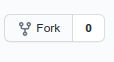

# Application Programming Interface (API)  Workshop Solution

Welcome to Application Programming Interface (API) Workshop.  API allows communication from one software application to another software application. You will be building an API using Python - Flask.  

## Prerequisities 

1. [Python 3.x](https://www.python.org/downloads/) 
2. [yahooquery](https://github.com/dpguthrie/yahooquery)
3. [Flask](https://flask.palletsprojects.com/en/1.1.x/installation/)
4. [sqlalchemy](https://www.sqlalchemy.org/download.html)
5. [Postman](https://www.postman.com/downloads/)

## Git

### Option 1
Click on the Fork icon



This will create a copy of repository. Once you have a copy, you can clone the repo: ```git clone https://github.com/username/repo-name.git```

### Option 2
Clone the repo on your local machine by clicking the code button


After clicking the button, select HTTPS option and use the command below:

```git clone https://github.com/username/repo-name.git```

## Virtual Environment setup
To setup the virtual environment:

* Linux/MacOSX
```python3 -m venv workshop```

* Windows

Here are two links for the setup.

- [Windows-Virtual-Environment-setup-1](https://mothergeo-py.readthedocs.io/en/latest/development/how-to/venv-win.html)
- [Windows-Virtual-Environment-setup-2](https://www.c-sharpcorner.com/article/steps-to-set-up-a-virtual-environment-for-python-development/)

To activate the virtual environments:
1. Linux/MacOSX

* ```source workshop/bin/activate```

2. Windows - Has Multiple ways to activate the virtual environments

* ```workshop/bin/Activate.ps1```
* ```C:\> workshop\Scripts\activate.bat```
* ```PS C:\> workshop\Scripts\Activate.ps1```

To deactivate virtual environment in any OS
* ```deactivate```

## Requirements.txt
You will notice a requirements text file.  Use this following command:
```pip install -r requirements.txt```

This will help setup the required packages in your environment.


